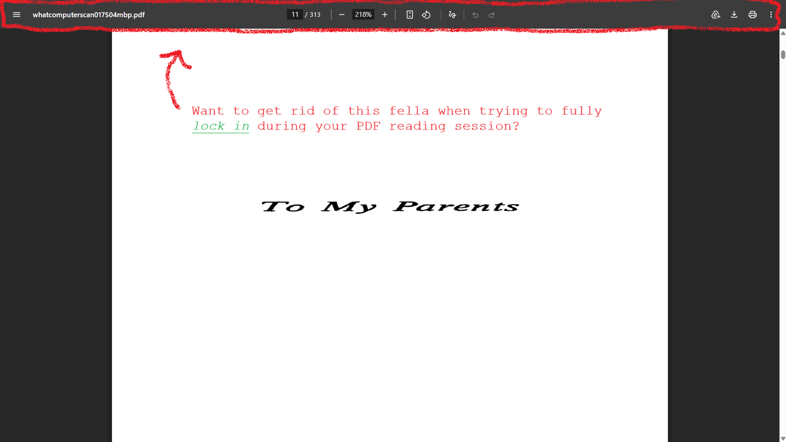
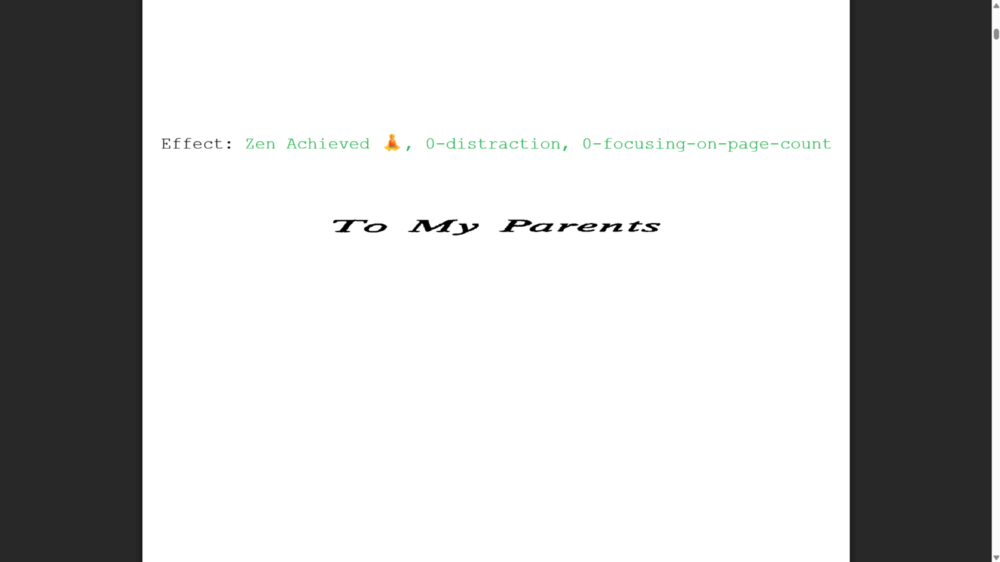

# Zen mode for PDF viewer in Google Chrome

This extension let's you hide the toolbar at the top of the PDF viewer in Google Chrome.

## Problem

Have you, as a Google Chrome user, ever been in this situation?: 

All your problems can go away with our simple, flexible and modest solution: **Zen PDF Chrome**

All you have to do is toggle the toolbar with `Alt + Z` keyboard combination

## Solution

## How to use the extension?

1. Download the repository
2. Go to extension page by entering in search bar: `chrome://extensions`
3. Click the `Load unpacked` button
4. Select `zen-pdf-chrome` directory
5. The extension should now be visible in the `All Extensions` section
6. Open any PDF, either stored locally or served via HTTP/HTTPS, and enjoy your Zen PDF Mode with the power of `ALT + Z`!